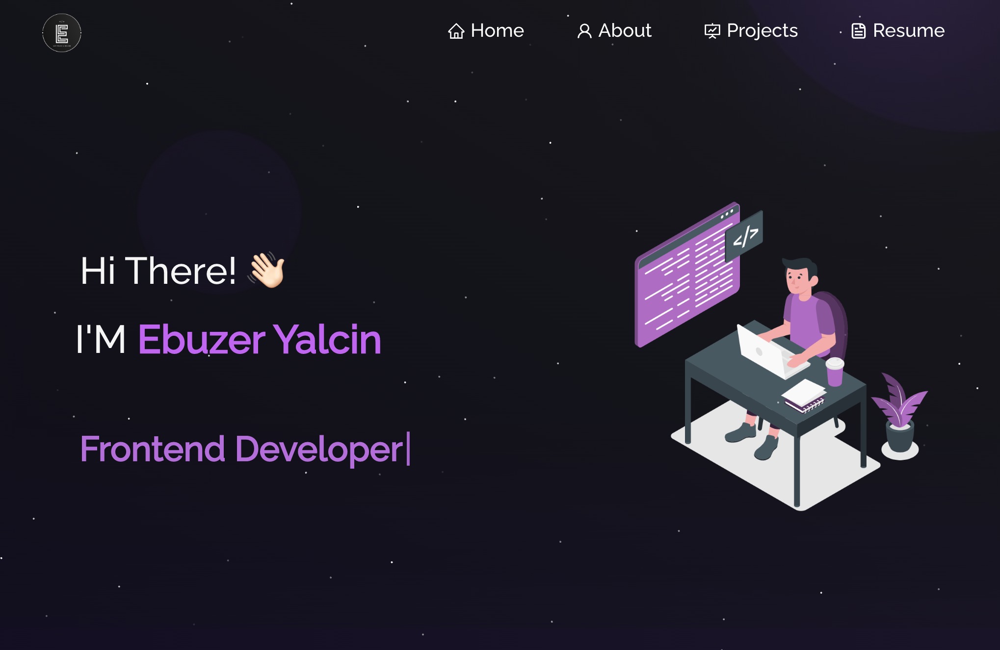

<h2 align="center">
  Portfolio Website...coming soon 
  <a href="https://ebuzeryalcin.vercel.app/" target="_blank">ebuzeryalcin-portfolio</a>
</h2>

  

 

 &nbsp;
 &nbsp;
 &nbsp;

## Built With

This project was built using these technologies.

- React.js
- Node.js
- CSS3
- VsCode
- Vercel

## Features

**📖 Multi-Page Layout**

**🎨 Styled with React-Bootstrap and Css with easy to customize colors**

**📱 Fully Responsive**

# Portfolio-master
# Portfolio-master
